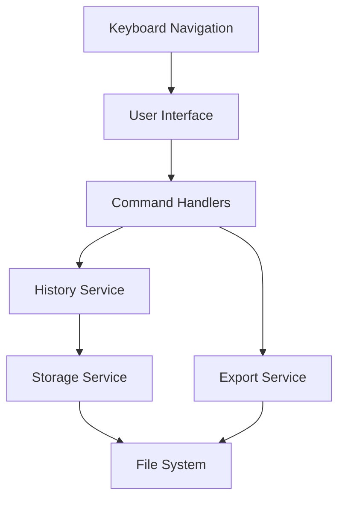

# Design Document: Conversation History Persistence

## Overview

The Conversation History Persistence feature will enhance the Azure OpenAI Chat application by implementing a robust system for storing, retrieving, and managing conversation histories. This design document outlines the architecture, components, data models, and implementation strategies for this feature.

The system will use a file-based storage approach with JSON as the primary data format, providing a balance between simplicity and functionality. The implementation will focus on maintaining a seamless user experience while ensuring data integrity and privacy.

## Architecture

The conversation history persistence feature will follow a layered architecture:

1. **Presentation Layer**: Command handlers and UI components for history-related interactions
2. **Service Layer**: Core logic for managing conversation history operations
3. **Data Layer**: Storage and retrieval mechanisms for conversation data



### Key Components

1. **Storage Service**: Handles the low-level file operations for saving and loading conversation data
2. **History Service**: Manages conversation sessions, history navigation, and data transformation
3. **Command Handlers**: Process user commands related to history management
4. **Export Service**: Handles conversation export to different formats
5. **Keyboard Navigation Handler**: Manages history navigation using keyboard shortcuts

## Components and Interfaces

### Storage Service

The Storage Service will be responsible for the persistence of conversation data to the file system.

```typescript
interface StorageService {
  // Save conversation data to storage
  saveConversation(conversation: Conversation): Promise<void>;
  
  // Load conversation by ID
  loadConversation(id: string): Promise<Conversation | null>;
  
  // List all saved conversations
  listConversations(): Promise<ConversationMetadata[]>;
  
  // Delete a conversation
  deleteConversation(id: string): Promise<boolean>;
  
  // Delete all conversations
  clearAllConversations(): Promise<void>;
  
  // Save a named session
  saveSession(name: string, conversation: Conversation): Promise<void>;
  
  // Load a named session
  loadSession(name: string): Promise<Conversation | null>;
  
  // List all named sessions
  listSessions(): Promise<SessionMetadata[]>;
}
```

### History Service

The History Service will provide higher-level operations for managing conversation history.

```typescript
interface HistoryService {
  // Get current conversation
  getCurrentConversation(): Conversation;
  
  // Add message to current conversation
  addMessage(message: Message): Promise<void>;
  
  // Load a specific conversation
  loadConversation(id: string): Promise<boolean>;
  
  // Get conversation history
  getConversationHistory(): ConversationMetadata[];
  
  // Save current conversation as a named session
  saveSession(name: string): Promise<boolean>;
  
  // Load a named session
  loadSession(name: string): Promise<boolean>;
  
  // Get all named sessions
  getSessions(): SessionMetadata[];
  
  // Navigate message history (for keyboard navigation)
  getPreviousUserMessage(): string | null;
  getNextUserMessage(): string | null;
  
  // Export conversation
  exportConversation(format: ExportFormat, path?: string): Promise<string>;
}
```

### Command Handlers

Command handlers will process user commands related to conversation history.

```typescript
interface HistoryCommandHandlers {
  // Handle history command
  handleHistoryCommand(args: string[]): Promise<void>;
  
  // Handle save command
  handleSaveCommand(args: string[]): Promise<void>;
  
  // Handle load command
  handleLoadCommand(args: string[]): Promise<void>;
  
  // Handle sessions command
  handleSessionsCommand(args: string[]): Promise<void>;
  
  // Handle export command
  handleExportCommand(args: string[]): Promise<void>;
  
  // Handle clear history command
  handleClearCommand(args: string[]): Promise<void>;
}
```

## Data Models

### Conversation

```typescript
interface Conversation {
  id: string;
  messages: Message[];
  createdAt: number;
  updatedAt: number;
  metadata?: {
    title?: string;
    tags?: string[];
    summary?: string;
  };
}
```

### Message

We'll use the existing Message interface and extend it if needed:

```typescript
interface Message {
  role: 'user' | 'assistant';
  content: string;
  timestamp: number;
  isStreaming?: boolean;
}
```

### ConversationMetadata

```typescript
interface ConversationMetadata {
  id: string;
  createdAt: number;
  updatedAt: number;
  messageCount: number;
  preview: string;
  title?: string;
}
```

### SessionMetadata

```typescript
interface SessionMetadata {
  name: string;
  conversationId: string;
  createdAt: number;
  updatedAt: number;
  messageCount: number;
  preview: string;
}
```

### ExportFormat

```typescript
type ExportFormat = 'json' | 'markdown' | 'text';
```

## Storage Structure

The conversation history will be stored following the XDG Base Directory Specification, which provides a standard for storing user-specific application data. This ensures compatibility with different operating systems and respects user preferences for data storage locations.

```
$XDG_DATA_HOME/azure-openai-chat/
  ├── conversations/
  │   ├── {conversation-id}.json
  │   └── ...
  ├── sessions/
  │   ├── {session-name}.json
  │   └── ...
  └── history.json
```

Where `$XDG_DATA_HOME` defaults to `~/.local/share` on Linux/macOS if not set. On macOS, we may also consider using `~/Library/Application Support/azure-openai-chat/` as an alternative that follows macOS conventions.

For Windows systems, the equivalent would be `%APPDATA%\azure-openai-chat\`.

The implementation will:
1. Detect the operating system
2. Determine the appropriate base directory according to platform standards
3. Create the necessary subdirectories if they don't exist

- `conversations/`: Contains individual conversation files
- `sessions/`: Contains named session files (which reference conversations)
- `history.json`: Stores message history for keyboard navigation

## Error Handling

The system will implement robust error handling to ensure that failures in the persistence layer don't affect the core chat functionality:

1. **Storage Errors**: If saving fails, the system will log the error and continue operation
2. **Loading Errors**: If loading fails, the system will display an error message and continue with an empty or current conversation
3. **Export Errors**: If export fails, the system will provide a detailed error message to the user

```typescript
class StorageError extends Error {
  constructor(message: string, public operation: 'save' | 'load' | 'delete' | 'list', public cause?: Error) {
    super(`Storage error during ${operation}: ${message}`);
    this.name = 'StorageError';
  }
}
```

## Testing Strategy

The testing strategy will focus on ensuring data integrity and proper error handling:

1. **Unit Tests**:
   - Test storage service operations
   - Test history service logic
   - Test command handlers
   - Test export functionality

2. **Integration Tests**:
   - Test the complete flow from user command to storage
   - Test error scenarios and recovery
   - Test data consistency across application restarts

3. **Edge Cases**:
   - Test with very large conversations
   - Test with invalid or corrupted storage files
   - Test with concurrent operations

## Implementation Approach

The implementation will follow these steps:

1. Create the storage service with basic file operations
2. Implement the history service with core functionality
3. Add command handlers for user interaction
4. Implement keyboard navigation for history
5. Add export functionality
6. Integrate with the existing application

The implementation will prioritize:
- Non-blocking operations to maintain UI responsiveness
- Data integrity to prevent loss of conversation history
- Graceful error handling to maintain a good user experience
- Backward compatibility with existing application components