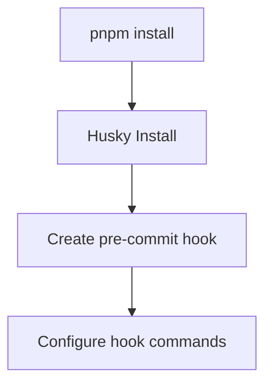

# Design Document: Pre-commit Hook

## Overview

The pre-commit hook feature will implement Git hooks that automatically run code quality checks before allowing commits. This design document outlines the architecture, components, and implementation details for adding pre-commit hooks to the Azure OpenAI Chat application. The solution will use Husky for Git hook management and Biome for code linting and formatting, integrated with the project's TypeScript setup.

## Architecture

The pre-commit hook system will consist of the following components:

1. **Hook Manager**: Husky will be used to manage Git hooks, providing a reliable way to install and configure hooks across different environments.

2. **Staged Files Filter**: lint-staged will be used to run operations only on staged files, improving performance by avoiding checks on unchanged files.

3. **Code Quality Tools**: Biome will be used for linting and formatting TypeScript/TSX files.

4. **Type Checker**: TypeScript compiler will be used for type checking.

5. **Test Runner**: Vitest will be used to run tests related to changed files.

6. **Configuration System**: Configuration files for each tool to customize behavior.

7. **Hook Scripts**: Custom scripts for specific hook actions and bypass mechanisms.

## Components and Interfaces

### 1. Hook Manager (Husky)

Husky will be used to install and manage Git hooks. It will:
- Install hooks during `pnpm install`
- Provide a way to bypass hooks when needed
- Execute the configured commands for each hook



### 2. Staged Files Filter (lint-staged)

lint-staged will be used to:
- Filter staged files by patterns
- Run commands only on staged files
- Re-stage files after automatic fixes

### 3. Code Quality with Biome

Biome will be configured to:
- Lint TypeScript/TSX files
- Format code according to project standards
- Provide error messages for quality issues
- Automatically fix formatting issues when possible

### 4. Type Checking

The TypeScript compiler will be used to:
- Check types in the entire project
- Ensure type safety before commits
- Provide clear error messages for type issues

### 5. Test Runner

Vitest will be configured to:
- Run tests related to changed files
- Provide fast feedback on test failures
- Skip tests when explicitly requested

## Data Models

### 1. Hook Configuration

```typescript
interface HuskyConfig {
  hooks: {
    [hookName: string]: string;
  };
}
```

### 2. lint-staged Configuration

```typescript
interface LintStagedConfig {
  [filePattern: string]: string | string[];
}
```

### 3. Biome Configuration

```typescript
interface BiomeConfig {
  formatter?: {
    enabled: boolean;
    indentStyle: "tab" | "space";
    indentWidth: number;
    lineWidth: number;
  };
  linter?: {
    enabled: boolean;
    rules: {
      [ruleName: string]: "error" | "warn" | "off";
    };
  };
}
```

## Error Handling

1. **Hook Installation Errors**:
   - Display clear error messages
   - Provide instructions for manual setup
   - Log errors to console

2. **Linting and Formatting Errors**:
   - Show file paths and line numbers
   - Display rule violations
   - Provide suggestions for fixes

3. **Type Checking Errors**:
   - Show detailed type errors
   - Include file locations
   - Suggest possible fixes

4. **Test Failures**:
   - Show test names and failure messages
   - Include stack traces for debugging
   - Indicate which changes caused the failures

## Testing Strategy

1. **Unit Tests**:
   - Test custom hook scripts
   - Verify hook installation process
   - Test bypass mechanisms

2. **Integration Tests**:
   - Verify hooks run correctly on commits
   - Test with various file types and changes
   - Ensure hooks can be bypassed when needed

3. **Manual Testing**:
   - Verify hook behavior in different environments
   - Test with different Git clients
   - Verify performance with large changesets

## Implementation Details

### 1. Package Dependencies

The following packages will be added to the project:
- `husky`: For Git hook management
- `lint-staged`: For running commands on staged files
- `@biomejs/biome`: For linting and formatting

### 2. Hook Installation

Husky will be configured to install hooks automatically during `pnpm install`. This will be done by:
1. Adding a `prepare` script to package.json
2. Creating a `.husky` directory with hook scripts
3. Setting up the pre-commit hook to run lint-staged

### 3. lint-staged Configuration

A `.lintstagedrc.js` file will be created to configure which commands run on which files:
- TypeScript/TSX files: Biome lint and format
- All files: TypeScript type checking
- Test files: Run related tests

### 4. Biome Configuration

A `biome.json` file will be created to configure Biome's behavior:
- Linting rules aligned with project standards
- Formatting settings for consistent code style
- Ignore patterns for files that should not be linted/formatted

### 5. Bypass Mechanisms

Several bypass mechanisms will be implemented:
- `--no-verify` Git flag for bypassing all hooks
- `SKIP_HOOK=lint` environment variable for skipping specific checks
- Configuration options for customizing hook behavior

### 6. Performance Considerations

To ensure hooks run quickly:
- Only staged files will be checked
- Type checking will be optimized to focus on affected files
- Tests will be filtered to only run those related to changes

## Migration Plan

1. **Initial Setup**:
   - Add required dependencies
   - Create initial configuration files
   - Set up basic pre-commit hook

2. **Developer Documentation**:
   - Update README with hook information
   - Document bypass mechanisms
   - Provide troubleshooting guidance

3. **Rollout**:
   - Introduce hooks with minimal checks first
   - Gradually add more strict checks
   - Collect feedback and adjust configurations